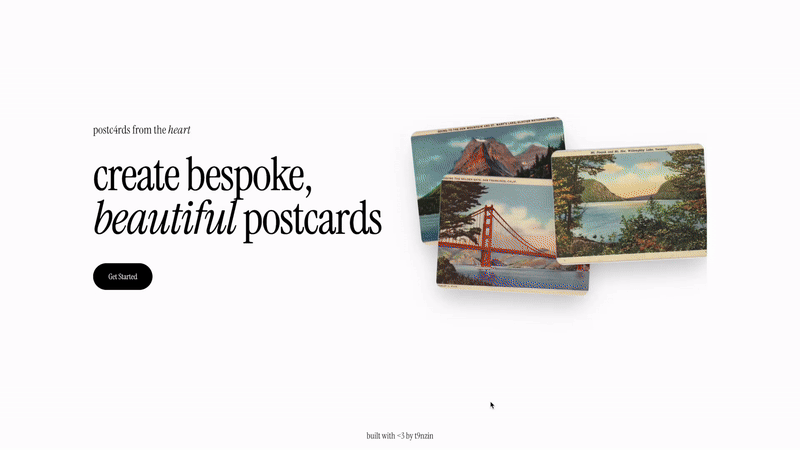
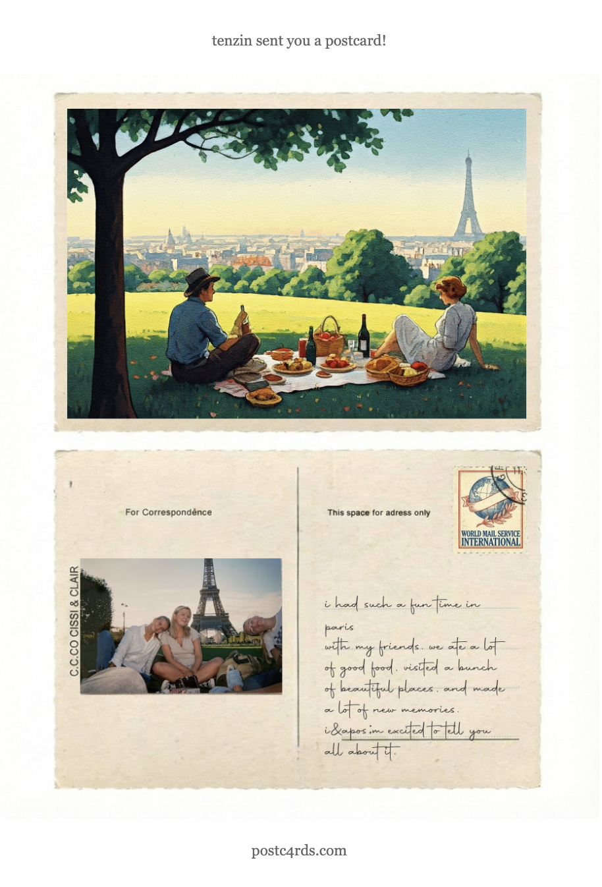

# postc4rds

An AI postcard generator that transforms your travel photos into vintage 1940s-style postcards and sends them to your loved ones via email. Try it out at [postc4rds.com](https://postc4rds.com)

<p align="left">
  
  
</p>

## Description

Upload a photo and let AI create a unique vintage travel postcard inspired by its location and theme. Add a personal message in handwritten font, and send it to anyone via email. 

I built this because one of my 2026 resolutions is to travel more, and I want to share my adventures with my friends + family in a fun, interesting way. :D

## Built With

- Next.js 16
- Vertex AI (Gemini Vision, Imagen 3 Fast)
- Cloudinary
- Sharp
- Prisma + PostgreSQL
- Resend

## Local Setup

1. Clone the repository:
```bash
git clone https://github.com/t9nzin/postc4rds.git
cd postc4rds
```

2. Install dependencies:
```bash
npm install
```

3. Configure environment variables in `.env`:
```env
DATABASE_URL="postgresql://..."
DIRECT_URL="postgresql://..."

DISABLE_GENERATION=false
CLOUDINARY_URL="cloudinary://..."
RESEND_API_KEY="re_..."

UPSTASH_REDIS_REST_URL="..."
UPSTASH_REDIS_REST_TOKEN="..."

GOOGLE_APPLICATION_CREDENTIALS_JSON='{"type":"service_account",...}'
GOOGLE_CLOUD_PROJECT="your-project-id"

```

4. Run database migrations:
```bash
npx prisma migrate dev
```

5. Start development server:
```bash
npm run dev
```

## License

MIT
